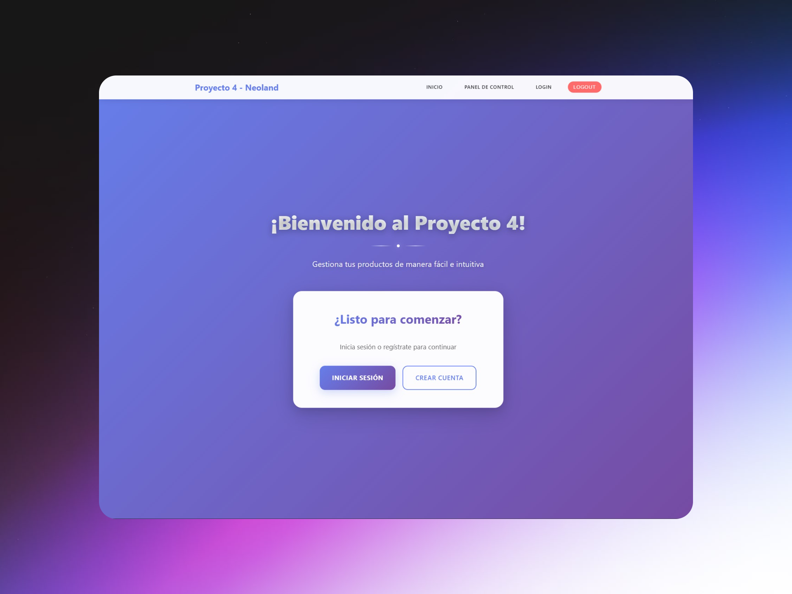
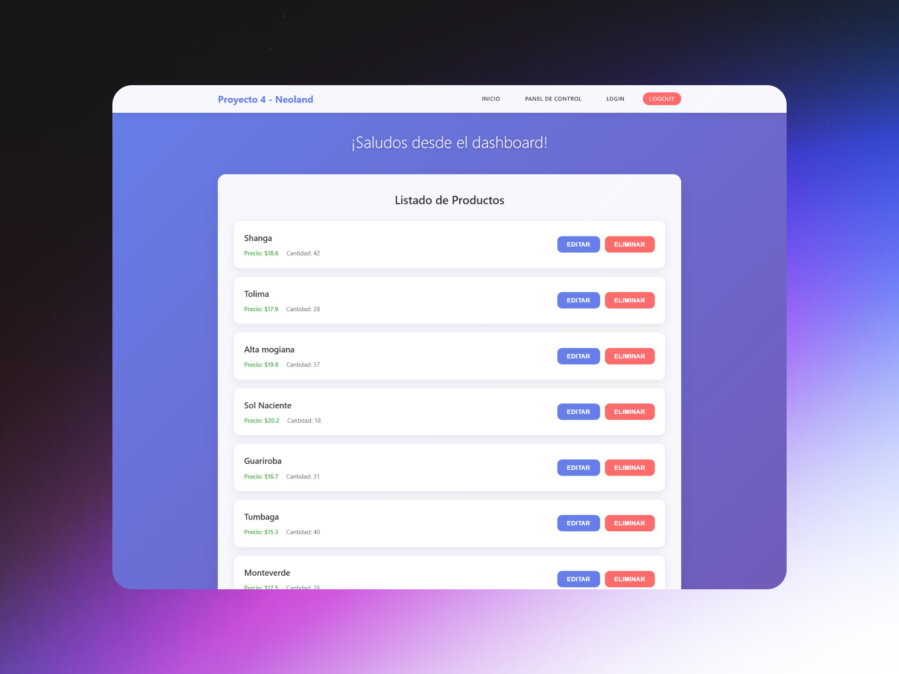
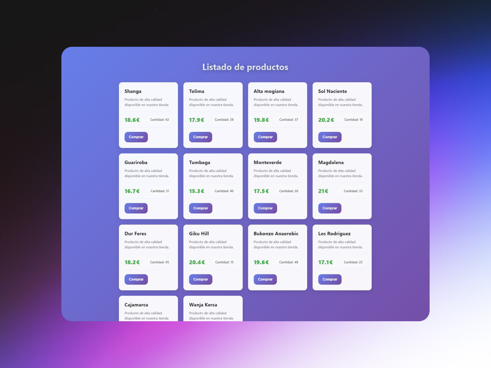

# Neoland Proyecto Server 🛒💻

Servidor backend desarrollado en Node.js con Express y MongoDB para la gestión de usuarios, productos y compras. Utiliza arquitectura MVC, motor de vistas EJS y control de acceso mediante middlewares. Está diseñado para integrarse con un frontend o utilizarse directamente como base para un sistema de e-commerce o dashboard administrativo.

## 🧠 Descripción

Este proyecto implementa un sistema completo de servidor que permite la gestión de recursos como usuarios, productos y compras, con rutas protegidas, autenticación y renderizado dinámico de vistas en EJS. La base de datos utilizada es MongoDB, gestionada mediante Mongoose.

## ⚙️ Funcionalidad

- **Usuarios**:
  - Registro e inicio de sesión.
  - Gestión de sesiones mediante JWT y cookies.
  - Middleware para comprobar usuarios logeados.

- **Productos**:
  - Crear, listar, obtener, actualizar y eliminar productos.
  - Validación de datos en creación y actualización.
  - Persistencia en base de datos MongoDB.

- **Compras**:
  - Registro y consulta de compras realizadas.
  - Asociación de compras con usuarios.

- **Vistas dinámicas (EJS)**:
  - Dashboard administrativo.
  - Páginas de login, registro, gestión de productos y compras.

## 🛠️ Tecnologías usadas

- **Node.js** como entorno de ejecución.
- **Express** como framework backend.
- **EJS** como motor de plantillas para vistas.
- **MongoDB** como base de datos.
- **Mongoose** para modelado de datos.
- **bcrypt** para encriptación de contraseñas.
- **jsonwebtoken (JWT)** para autenticación.
- **dotenv** para gestión de variables de entorno.
- **cors** para control de acceso.
- **morgan** como logger HTTP.
- **cookie-parser** para gestión de cookies.

## 📁 Estructura del proyecto

```
NEOLAND-PROYECTO-SERVER/
│
├── public/                      # Archivos estáticos (imágenes, CSS, JS cliente)
│
├── src/
│   ├── config/                   # Configuración de conexión a BBDD
│   │   └── db.config.js
│   ├── controllers/              # Lógica de negocio
│   ├── middlewares/              # Middlewares de autenticación y validación
│   ├── models/                   # Modelos de datos (Mongoose)
│   ├── routes/                   # Rutas y endpoints
│   └── views/                    # Vistas EJS
│
├── app.js                        # Configuración principal de Express
├── bin/www                       # Arranque del servidor
├── .env-example                  # Variables de entorno de ejemplo
├── package.json                  # Dependencias y scripts
└── README.md
```

## 🚀 Instalación y puesta en marcha

1. Clona el repositorio:
   ```
   git clone https://github.com/usuario/NEOLAND-PROYECTO-SERVER.git
   cd NEOLAND-PROYECTO-SERVER
   ```

2. Instala las dependencias:
   ```
   npm install
   ```

3. Crea un archivo `.env` en la raíz del proyecto basándote en `.env-example` e incluye tu configuración:
   ```
   PORT=3000
   MONGO_URI=mongodb://localhost:27017/tu_basedatos
   JWT_SECRET=tu_clave_secreta
   ```

4. Inicia el servidor en modo desarrollo:
   ```
   npm run dev
   ```
   O en modo producción:
   ```
   npm start
   ```

5. El servidor estará disponible en:
   ```
   http://localhost:4000
   ```

## 📝 Ejemplo de endpoints

### Productos
- **GET** `/api/products` → Lista todos los productos.
- **GET** `/api/products/:id` → Obtiene un producto por su ID.
- **POST** `/api/products` → Crea un nuevo producto.
- **PUT** `/api/products/:id` → Actualiza un producto existente.
- **DELETE** `/api/products/:id` → Elimina un producto.

## 📸 Capturas de pantalla





## 🤝 Contacto

Si quieres ponerte en contacto conmigo:

- [GitHub](https://github.com/davidrguez98)
- [LinkedIn](https://www.linkedin.com/in/david-rodr%C3%ADguez-p%C3%A9rez-softdev/)
- Correo: ropeda98@gmail.com
